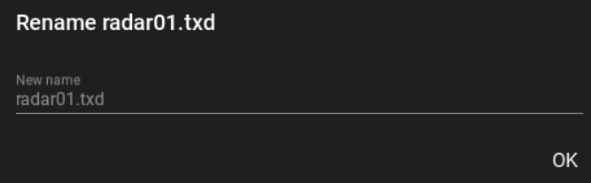

# Universal iMG

https://github.com/NIKDISSV-Forever/UniversalIMG

### Open & edit .img files for gta III / VC / SA (+GUI)

# GUI


## Buttons

### Hotkeys

<kbd>F2</kbd> <kbd>Ctrl+O</kbd> - Open | Открыть

<kbd>F3</kbd> <kbd>Ctrl+E</kbd> - Extract | Извлечь

<kbd>Ctrl+A</kbd> - Add | Добавить

<kbd>Ctrl+Shift+A</kbd> - Select All | Выбрать всё

<kbd>F4</kbd> <kbd>Ctrl+D</kbd> - Delete | Удалить

<kbd>F5</kbd> <kbd>Ctrl+R</kbd> - Reload | Перезагрузить

<kbd>F6</kbd> <kbd>Ctrl+Shift+R</kbd> - Rebuild | Перестроить

<kbd>F7</kbd> <kbd>Ctrl+L</kbd> - Light (Theme) | Лампочка (Тема)


While something works, other buttons are disabled.

Если вы нажали на что-то, кнопки побледнеют пока то на что вы нажали, делает что должно


There are light and dark themes, the letter A under the light bulb means that the theme depends on the theme of the
system (Win 10)

Есть светлая и тёмная темы, буква A под лампочкой означает, что тема зависит от темы системы (Win 10)


## Files list


Click on the button with the file name to rename it.

Нажмите на кнопку с именем файла чтоб его переименовать.


### Sorting

Нажмите на название колонки чтобы по ней отсортировать.

Just click on a column heading to sort.


### Navigation bar

Specify the size and page number. Search by file name.

Указывайте размер и номер страницы. Ищите по названию файла.


Up/Down Arrows, Top (First Page)/Down (Last Page) Arrows

Стрелки вверх/вниз, в самый верх (первая страница)/в самый низ (последняя страница)

### Select all

Select all files to delete or export (see Buttons)

Ничего особенного. Выберите все файлы, чтоб их удалить или экспортировать (смотрите Buttons)


## Logging

[freimgedcs](https://code.google.com/archive/p/freimgedcs) output. If it has Failed, then something is going wrong.

Вывод [freimgedcs](https://code.google.com/archive/p/freimgedcs). Если в нём есть Failed, значит что-то идёт не так.


## Progress bar

There is a progress display.

Если что-то происходит с группой файлов, эта оранжевая полоска будет двигаться.


# Code

> pip install [UniversalIMG](https://pypi.org/project/UniversalIMG)

```python
class BlocksBytes:
    """Class for storing Block/Size format data present in the html file generated by the -lst command"""

    def __init__(self, bb: str):
        ...


class ArchiveContent:
    """Stores one line data from the generated html file"""

    def __init__(self, offset: str, size: str, name: str):
        ...


class IMGArchive:
    """API for freimgedcs.exe"""

    def __init__(self, imgname: str | Path,
                 freimgedcs_path: str = get_freimgedcs_exe()):
        ...

    def rebuild(self):
        """Rebuild archive (imgname)"""
        ...

    def list(self, *, delete_html_file: bool = False):
        """
        Returns the header of the opened archive, information about it, and a list of files of the class ArchiveContent
        """
        ...

    def add(self, filename: str):
        """Add/replace file [filename] to/in archive (imgname)"""
        ...

    def extract(self, filename: str, filename2: str):
        """Extract file [filename] from archive (imgname) to file [filename2]"""
        ...

    def rename(self, filename: str, filename2: str):
        """Rename file [filename] in archive (imgname) to file [filename2]"""
        ...

    def delete(self, filename: str):
        """Delete file [filename] from archive (imgname)"""
        ...
```
